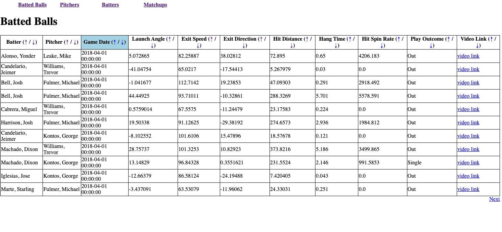

# Batted Ball data

This is a [flask](https://flask.palletsprojects.com/en/2.0.x/) app that reads batted ball data from an .xlsx file and displays the data in a simple web app.

Screenshots:


## Setup

The .xlsx file requires columns with headings:
```
BATTER, PITCHER, GAME_DATE, LAUNCH_ANGLE, EXIT_SPEED, EXIT_DIRECTION, HIT_DISTANCE, HANG_TIME, HIT_SPIN_RATE, PLAY_OUTCOME, VIDEO_LINK
```
The .xlsx file should be placed in the `uploads` directory.

Install with pip:

```
$ pip install -r requirements.txt
```

## App Usage

The tables provided in the web app can be sorted in ascending and descending order using the &uarr; and &darr; arrows on each column heading.

The column heading used for sorting will be highlighted.
